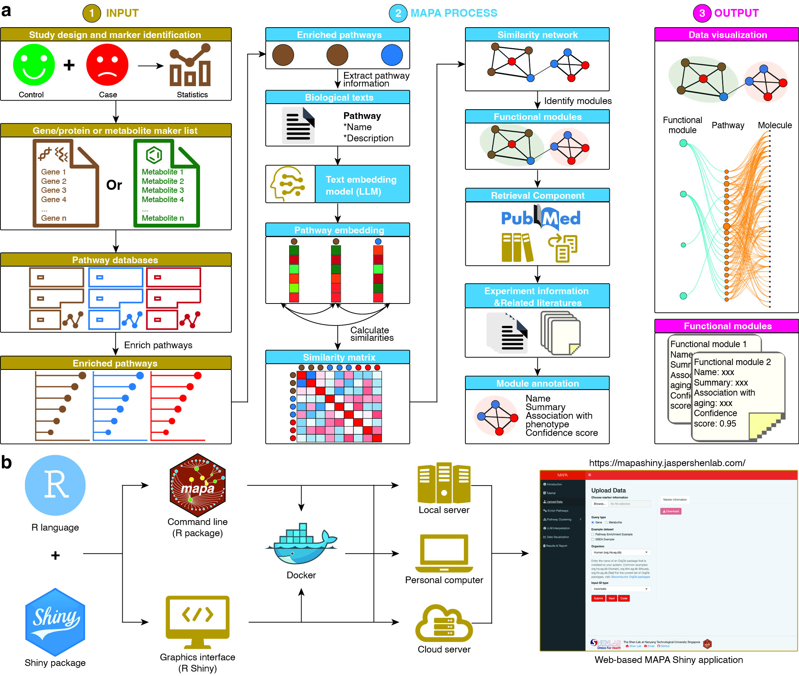
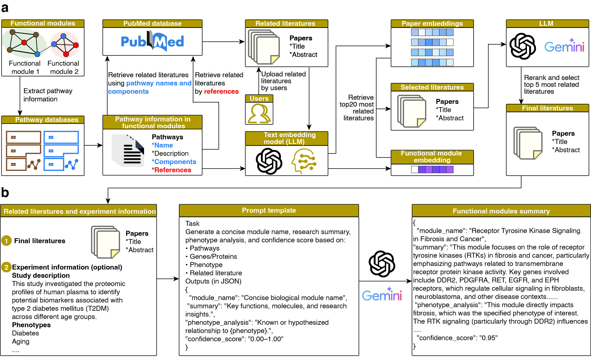
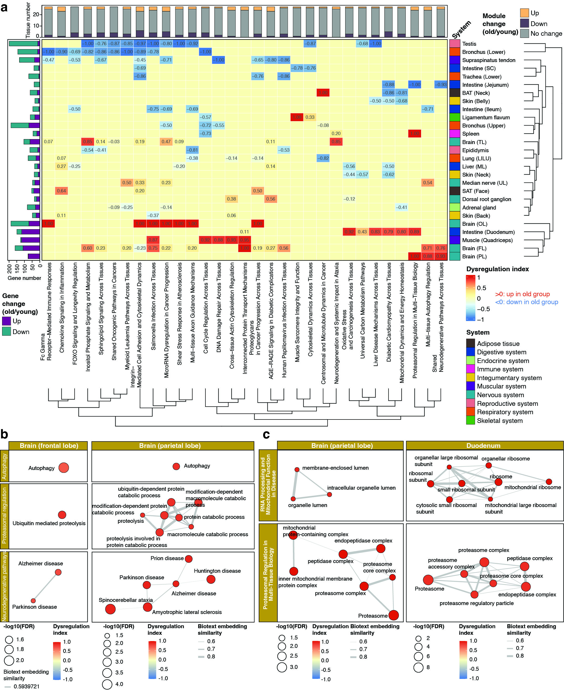

# 🚀 MAPA Released: Leveraging Large Language Models for Redundancy-Aware Pathway Analysis and Deep Biological Interpretation

We are excited to announce the release of MAPA (Functional Module Identification and Annotation for Pathway Analysis Results Using Large Language Models), a novel computational framework developed by the Shen Lab that leverages large language models (LLMs) and retrieval-augmented generation (RAG) to tackle one of the most pervasive challenges in omics data analysis: redundancy and fragmentation in pathway enrichment results.

## 🔍 The Problem: Redundant and Fragmented Pathway Results

Functional enrichment analysis is a cornerstone of systems biology, helping researchers interpret lists of genes, proteins, or metabolites. However, conventional tools often return lengthy lists of overlapping pathways with similar biological meanings—making interpretation challenging and prone to subjective summarization.

## 💡 The MAPA Innovation

MAPA addresses this challenge with a two-stage approach:

1. Functional Module Identification: 

MAPA embeds enriched pathways into a semantic space using biomedical language embeddings and clusters them into non-redundant functional modules using graph-based community detection. This transforms noisy and overlapping results into structured biological themes.

2. Functional Module Annotation

Each module is automatically annotated using retrieval-augmented generation (RAG). MAPA queries biological pathway descriptions from public databases and prompts a large language model to generate concise, domain-aware functional annotations. The entire process is transparent, auditable, and reproducible.

## 🧪 Biological Insights from MAPA

In our manuscript, we applied MAPA to a multi-organ aging dataset from monkeys, integrating transcriptomics, proteomics, and metabolomics across 78 tissues. MAPA revealed:

* Coordinated age-related dysregulation across brain regions and the brain–gut axis, including shared ferroptosis vulnerability.
	
* A consistent decline in FOXO signaling across multiple tissues.
	
* Tissue-specific bidirectional changes in microRNA-mediated regulation, highlighting differential aging trajectories.

These findings go beyond traditional pathway analysis and demonstrate MAPA’s power to extract biologically meaningful and interpretable modules from complex multi-omics datasets.

🛠️ Try MAPA Now

MAPA is fully open-source and easy to use:
	
* 📜 Paper: https://doi.org/10.3390/nu16183079
	
* 🔗 GitHub: https://github.com/jaspershen-lab/mapa
	
* 🌐 Official website: https://www.shen-lab.org/mapa-website/
	
* 📖 Tutorial: https://www.shen-lab.org/mapa-tutorial/

* 🖥️ MAPA shiny: https://mapashiny.jaspershenlab.com/

We invite the community to explore MAPA, use it in your own analyses, and provide feedback!

## 📢 Join the Discussion

We are committed to open science and reproducibility. If you have questions, suggestions, or want to collaborate, please don’t hesitate to reach out via GitHub or our contact page.

—-----

MAPA was developed by the [Shen Lab at Nanyang Technological University Singapore](https://www.shen-lab.org/). Special thanks to Yifei Ge, Feifan Zhang, Yijiang Liu, and the entire team for their contributions.
